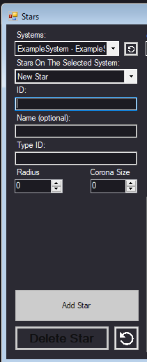

This tool allow screation of systems with a Windows Form Interface

Setuping:

Copy SGTExe folder under SGT folder & copy paste it into your mods main folder.

If you wish to just create systems simply opening the .exe under SGTExe will be enough on system creation.

& thats it! You can start creating systems.

Menu items
- [Main Form](#MainForm)
  - [File](#File)
    - [Close App](#CloseApp)
    - [Save](#Save)
    - [Export](#Export)
  - [System Generation](#File)
    - [Systems](#Systems)
    - [Stars](#Stars)
    - [Planets](#Planets)
    - [Markets](#Markets)
    - [Custom Entities](#CustomEntities)
    - [Ring Bands](#RingBands)
    - [Astreoid Belts](#AstreoidBelts)
    - [Map](#Map)
  - [Info](#Info)
  - [Preferances](#Preferances)
    - [Settings](#Settings)

<h id="MainForm">When first opening the form, you will see this panel.</h>

    

This form is the main panel for the tool, containing every other panel in itself.

On top you will see menu items, you can open all other forms using those.

<h1 id="File">File</h1>

Overall everything related to files can be found here

<h5 id="CloseApp">Close App</h5>

Closes the app, ctrl q for shortcut 

<h5 id="Save">Save</h5>

Saves the JSON file thats required for the system generation. **Not generated automatically when exiting**

<h5 id="Export">Export</h5>

For exporting generated JSON files, currently doesnt work.

<h1 id="SystemGeneration">System Generation</h1>

Everything that will be generated in-game can be found here.

<h3>Common Controls</h3>

Add X: Saves the item (doesnt save the json). 

Delete X: Deletes the item for **this session**.

Undo: Restores last deleted item **for this session**

    

<h3>  Values: </h3> 

Orbit Mode: The selected style of "orbit".

- 0: Fixed Location. Only requires X and Y.

- 1: Circular Orbit. Only requires Focus, Angle, Orbit Radius and Orbit Days.

- 2: Circular Orbit Pointing Down. Same as 1 but the orbiting item points down into its orbit.

- 3: Circular Orbit With Spin. Same as 1 but the item spins around itself, Requires Min Spin and Max Spin on top of 1s requirenments.

X, Y: Coordinates of the item.

Angle: The angle which the item spawns at, center being the focus.

Orbit Radius: The furtherness of the item from its focus.

Orbit Days: The amount of days the item takes to complete an orbit

Min Spin, Max Spin: < spin amount should change, i dont know exactly how >

<h5 id="Systems">Systems  </h5>

Systems can be generated here

    

<h3>  Values: </h3> 
  Selected System: The system selected for editing, select `New System` to generate a new one.

  
  ID: The in-game ID for the system, must be unique from every other system ID that will be generated in-game (tool doesnt allow creation of items with the same id)
  
  Name: An optional variable for the system, the name will be selected randomly if not inputted
  
  X,Y: The coordinates of the system over hyper-space
  
  Background Texture Path: The path of the background image for the system, must be relative to the root of the mod 
   - As example: `graphics/backgrounds/background3.jpg` will work but `C:/Program Files (x86)/Fractal Softworks/0.96a-RC9/mods/SGT/graphics/backgrounds/background3.jpg` will not work
  
  MinHyperspaceRadius: the radius which will remove the hyperspace clouds around the system.
  
  Auto Generate Enterances At Gas Giants: If set to true gas giants will generate enterances at hyperspace
  
  Generate Planet Conditions: If set to true planets will have automatic condition generation
  
  Auto Generate Fringe Jump Point: Automatical jump point creation

<h5 id="Stars">Stars  </h5>     

    

<h3>  Values: </h3> 

<h5 id="Planets">Planets  </h5>     
<h5 id="Markets">Markets  </h5>     
<h5 id="CustomEntities">Custom Entities  </h5>     
<h5 id="RingBands">Ring Bands  </h5>     
<h5 id="AstreoidBelts">Astreoid Belts  </h5>     
<h5 id="Map">Map </h5>     

