This tool allow screation of systems with a Windows Form Interface

Setuping:

Copy SGTExe folder under SGT folder & copy paste it into your mods main folder.

If you wish to just create systems simply opening the .exe under SGTExe will be enough on system creation.

& thats it! You can start creating systems.

Menu items
- [Main Form](#MainForm)
  - [File](#File)
    - [Close App](#CloseApp)
    - [Save](#Save)
    - [Export](#Export)
  - [System Generation](#File)
    - [Systems](#Systems)
    - [Stars](#Stars)
    - [Planets](#Planets)
    - [Markets](#Markets)
    - [Custom Entities](#CustomEntities)
    - [Ring Bands](#RingBands)
    - [Astreoid Belts](#AstreoidBelts)
    - [Map](#Map)
  - [Info](#Info)
  - [Preferances](#Preferances)
    - [Settings](#Settings)

<h id="MainForm">When first opening the form, you will see this panel.</h>

    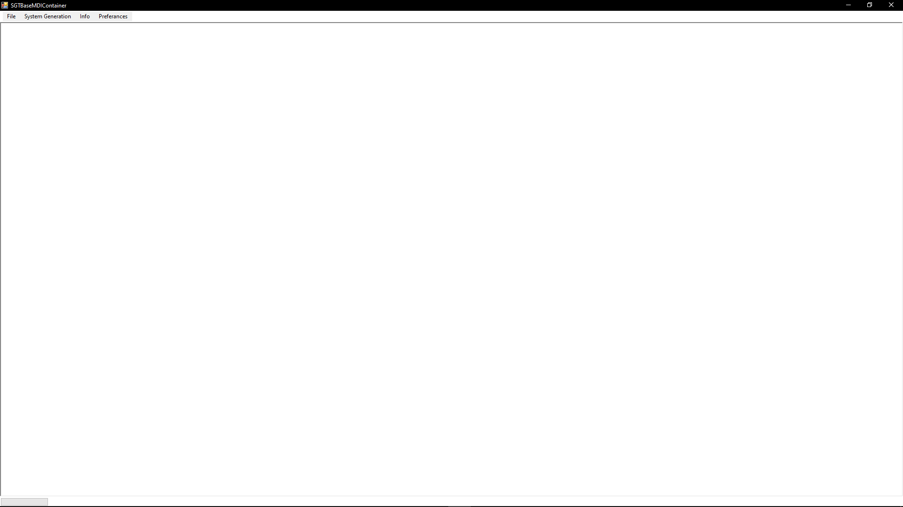

This form is the main panel for the tool, containing every other panel in itself.

On top you will see menu items, you can open all other forms using those.

<h1 id="File">File</h1>

Overall everything related to files can be found here

<h5 id="CloseApp">Close App</h5>

Closes the app, ctrl q for shortcut 

<h5 id="Save">Save</h5>

Saves the JSON file thats required for the system generation. Auto save is on my default when closing the app.

<h5 id="Export">Export</h5>

For exporting generated JSON files, currently doesnt work.

<h1 id="SystemGeneration">System Generation</h1>

Everything that will be generated in-game can be found here.

<h3>Common Controls</h3>

Add X: Saves the item (doesnt save the json). 

Delete X: Deletes the item for **this session**.

Undo: Restores last deleted item **for this session**

Refresh: Haves the same icon as Undo but is smaller and next to elements, refreshes the list of the element next to it.

    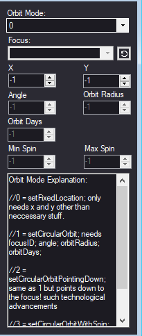

<h4>  Values: </h4> 

Orbit Mode: The selected style of "orbit".

- 0: Fixed Location. Only requires X and Y.

- 1: Circular Orbit. Only requires Focus, Angle, Orbit Radius and Orbit Days.

- 2: Circular Orbit Pointing Down. Same as 1 but the orbiting item points down into its orbit.

- 3: Circular Orbit With Spin. Same as 1 but the item spins around itself, Requires Min Spin and Max Spin on top of 1s requirenments.

X, Y: Coordinates of the item.

Angle: The angle which the item spawns at, center being the focus.

Orbit Radius: Orbit Distance.

Orbit Days: The amount of days the item takes to complete an orbit

Min Spin, Max Spin: < spin amount should change, i dont know exactly how >

<h3 id="Systems">Systems  </h3>

    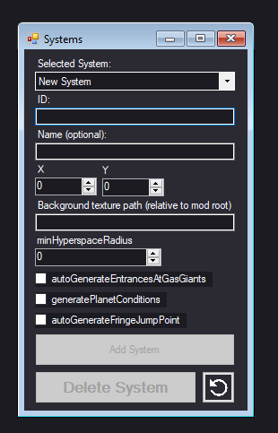

<h4>  Values: </h4> 
  Selected System: The system selected for editing, select `New System` to generate a new one.

  
  ID: The in-game ID for the system, must be unique from every other system ID that will be generated in-game (tool doesnt allow creation of items with the same id)
  
  Name: An optional variable for the system, the name will be selected randomly if not inputted
  
  X,Y: The coordinates of the system over hyper-space
  
  Background Texture Path: The path of the background image for the system, must be relative to the root of the mod 
   - As example: `graphics/backgrounds/background3.jpg` will work but `C:/Program Files (x86)/Fractal Softworks/0.96a-RC9/mods/SGT/graphics/backgrounds/background3.jpg` will not work
  
  MinHyperspaceRadius: the radius which will remove the hyperspace clouds around the system.
  
  Auto Generate Enterances At Gas Giants: If set to true gas giants will generate enterances at hyperspace
  
  Generate Planet Conditions: If set to true planets will have automatic condition generation
  
  Auto Generate Fringe Jump Point: Automatical jump point creation

<h3 id="Stars">Stars  </h3>     

    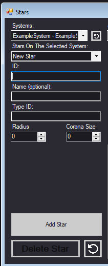

<h4>  Values: </h4> 

Parent System: Selected system to add Star into.

Stars On The Selected System: The list of Stars in the selected systems, click on one to edit it. Choice New Star to add a new one.

ID: Unique id for the Star. Tool doesnt allow duplicate IDs but still prefix your IDs.

Name: Optional variable for naming your Star, will be generated randomly if empthy.

Type ID: Type of the Star, they can be found under `\data\config\planets.json`

Radius: Radius of the Star.

Corona Size: The size of the corona.

<h3 id="Planets">Planets  </h3>     

    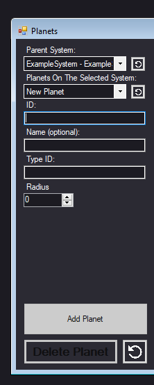

<h4>  Values: </h4> 

Parent System: Selected system to add Planet into.

Planets On The Selected System: The list of Planets in the selected systems, click on one to edit it. Choice New Planet to add a new one.

ID: Unique id for the Planet. Tool doesnt allow duplicate IDs but still prefix your IDs.

Name: Optional variable for naming your Planet, will be generated randomly if empthy.

Type ID: Type of the Planet, they can be found under `\data\config\planets.json`

Radius: Radius of the Planet.

<h3 id="Markets">Markets  </h3>     

    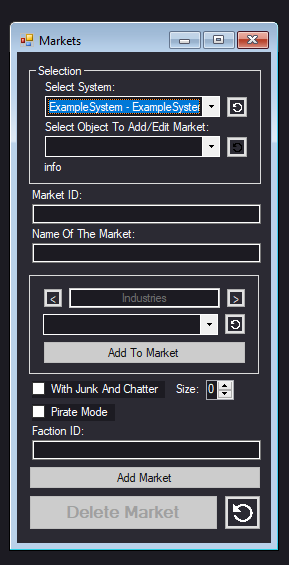

<h4>  Values: </h4> 

Selected System: Selected system to add markets into.

Select Object To Add/Edit Market: The object to add/edit market.

Info: Displays if the object already haves a market or not.

Market ID: Unique ID for the market.  Tool doesnt allow duplicate IDs but still prefix your IDs.

Name Of The Market: The name for the market.

Addables Area:

Use < and > to switch between `Industries`, `Submarkets`, `Conditions`, `Connected Entities`

When an addable is selected, they will be readen from the CSV files and be putten into the drop box under.

    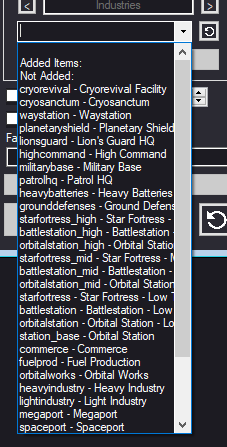

Then items to add can be selected or removed from here.

To add an item click on an item thats under the `Not Added` item, to remove an item select one thats under the `Added Items`

With Junk Or Chatter: Places junk and chatter around the planet if set to true.

Pirate Mode: < the planet is visible? >

Faction ID: Which faction the Market belongs to.

<h3 id="CustomEntities">Custom Entities  </h3>     

    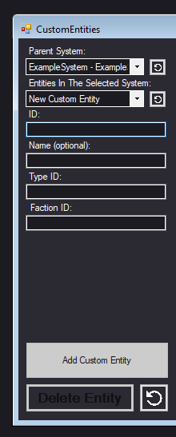

<h4>  Values: </h4> 

Parent System: Selected system to add Custom Entity into.

Entities On The Selected System: The list of Custom Entitys in the selected systems, click on one to edit it. Choice New Custom Entity to add a new one.

ID: Unique id for the Custom Entity. Tool doesnt allow duplicate IDs but still prefix your IDs.

Name: Optional variable for naming your Custom Entity, will be generated randomly if empthy.

Type ID: Type of the Custom Entity, they can be found under `\data\config\custom_entities.json`

Faction ID: Which faction the Entity belongs to.

<h3 id="RingBands">Ring Bands  </h3>     

    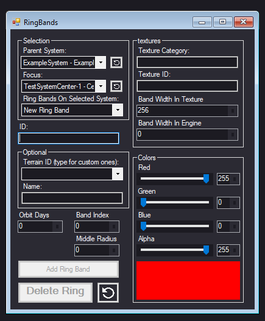

<h4>  Values: </h4> 

Parent System: Selected system to add Ring Band into.

Focus: The item Ring Band will orbit around.

Ring Bands On The Selected System: The list of Ring Bands in the selected systems, click on one to edit it. Choice New Ring Band to add a new one.

ID: Unique id for the Ring Band. Tool doesnt allow duplicate IDs but still prefix your IDs.

Terrain ID: Optional Terrain ID, used for effects. They can be found on `\data\campaign\terrain.json`

Name: Optional Name of the ring band, its what you will see when you're over the Band.

Orbit Days: The amount of days it takes to do a full 360 orbit.

Band Index: < the priority of terrain effects >

Middle Radius: Orbiting Distance.

Texture Category: The category on `settings.json`.

Texture ID: The ID of the texture inside of the category.

Band Width In Texture: Texture width, can be used for scaling shenanigans. Must be 2^n to not act weird.

Band Width In Engine: The width of the band that will be seen in-game.

Color: Tint of the Band.

<h3 id="AstreoidBelts">Astreoid Belts  </h3>     

    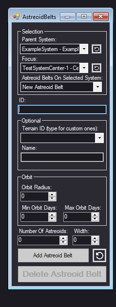

<h4>  Values: </h4> 

Parent System: Selected system to add Astreoid Belt into.

Focus: The item Astreoid Belt will orbit around.

Astreoid Belts On The Selected System: The list of Astreoid Belts in the selected systems, click on one to edit it. Choice New Astreoid Belt to add a new one.

ID: Unique id for the Astreoid Belt. Tool doesnt allow duplicate IDs but still prefix your IDs.

Terrain ID: Optional Terrain ID, used for effects. They can be found on `\data\campaign\terrain.json`

Name: Optional Name of the Astreoid Belt, its what you will see when you're over the Belt.

Orbit Radius: Orbit Distance.

Min,Max Orbit Days: The Min,Max time it takes for astreoids to do a full 360 orbit.

Number Of Astreoids: Astreoid amount on the belt.

Width: Width of the belt in-game.

<h3 id="Map">Map </h3>     

    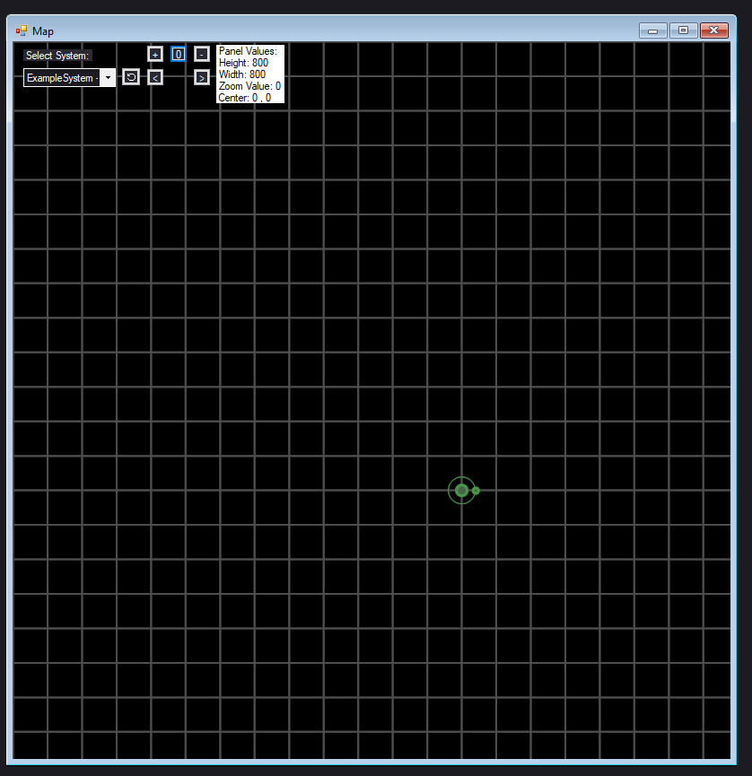

The preview of the system.

Selected System: System to preview.

You can use numpad to move around & use + & - to zoom in and out respectively.

the < and > buttons will change the size of the preview window

<h1>And thats it!</h1>

You know everything to make your own system, if you have more questions you can ping me in USC, Corvus or any other Starsector related server.
